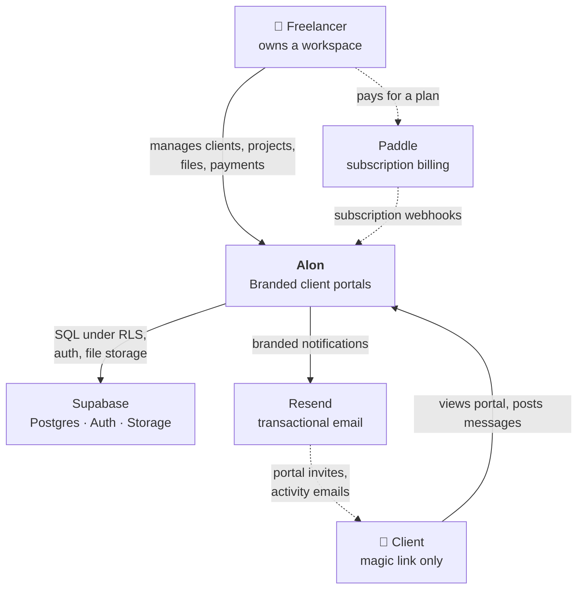
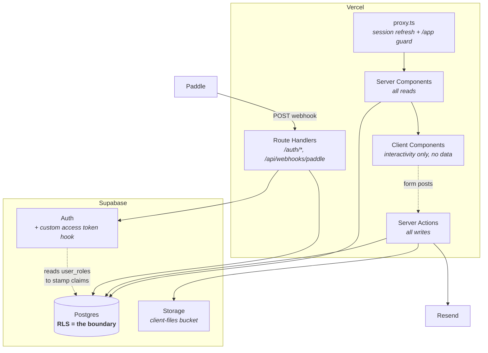
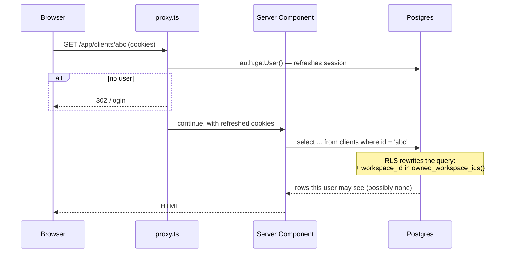
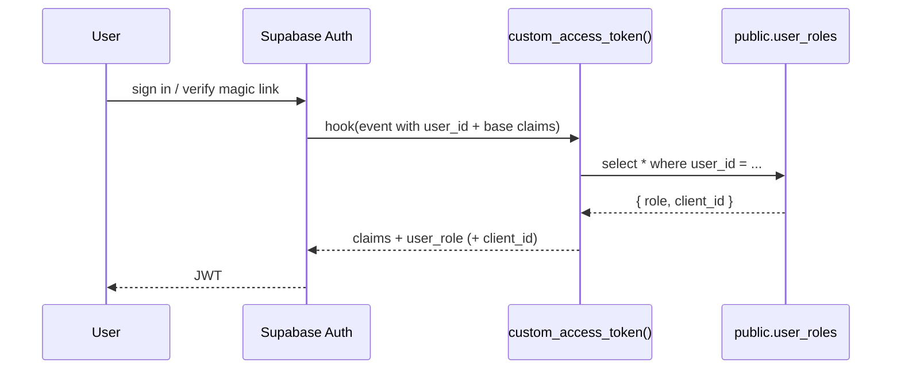
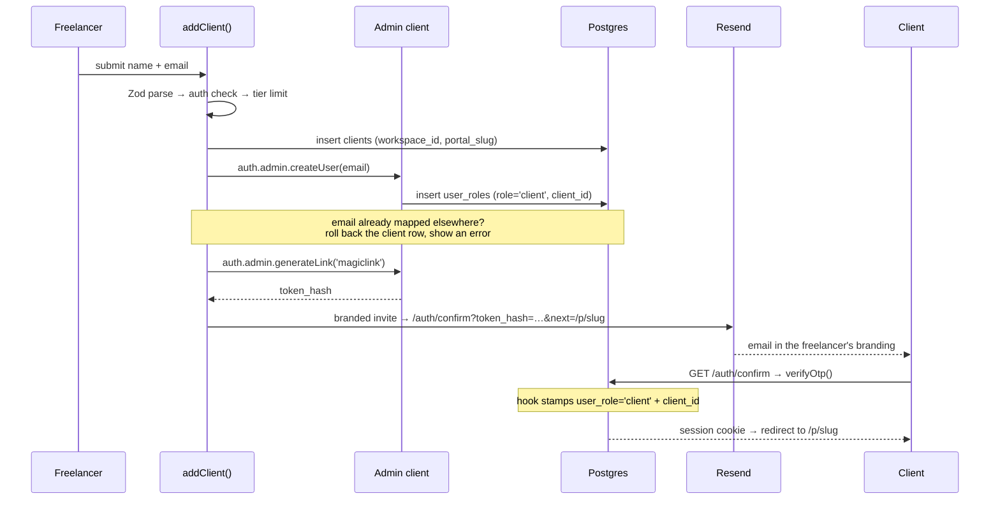
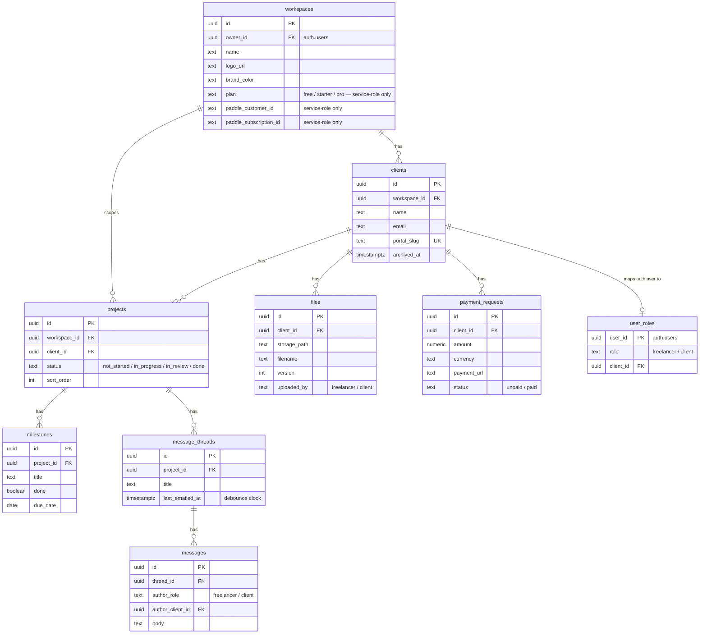
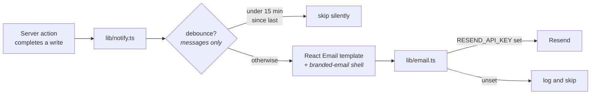
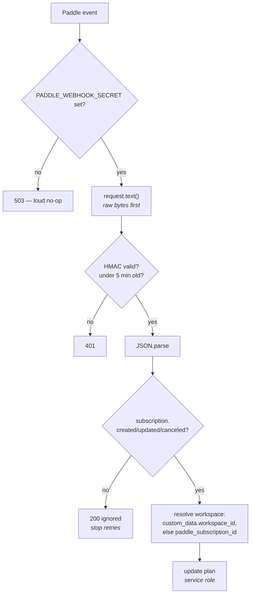

# Architecture

How Alon actually works, zooming from the outside in. Read top to bottom on your first day; after that, jump to the section you need.

This complements the other docs rather than repeating them: [`SPEC.md`](SPEC.md) is what we agreed to build, [`INSTRUCTIONS.md`](INSTRUCTIONS.md) is the original brief, [`DECISIONS.md`](../DECISIONS.md) is why specific choices were made. This file is *how the pieces fit*.

The structure borrows [C4](https://c4model.com/)'s zoom-in idea — system context, then containers, then inward — but stops short of formal C4 levels 3 and 4. This is one Next.js app plus hosted Supabase; a by-the-book component diagram would just be a file listing, while the two things that genuinely take time to learn here (the two-role auth model and RLS as the security boundary) have no home in C4's levels. Those get their own sections instead.

---

## 1. System context

Alon gives freelancers a branded portal for each of their clients — project status, files, messages, payment requests — replacing the email/Messenger/Drive juggle. Built for Filipino freelancers serving US/AU clients.

Two kinds of humans use it, and they are not equals:

- **Freelancers** sign up, own a workspace, and do essentially all the writing.
- **Clients** never sign up. They receive a magic link, land in a portal branded as *their freelancer's*, and can read everything about themselves plus post messages. That is the entire client surface.



Note the dotted lines: Paddle talks *to* us (webhooks), not the other way around, and Resend reaches the client on our behalf. Neither external system is in the request path for a page render.

---

## 2. Containers



Two things surprise people:

**There is no API layer.** No REST or GraphQL service sits between the app and the database. Server components query Postgres directly; server actions write to it directly. The security that an API layer would normally provide lives in the database instead (§5).

**There is no client-side data layer.** No React Query, no SWR, no `supabase.from(...)` in a `"use client"` file. Client components exist only for interactivity — they post to server actions and re-render from server state. This is deliberate: a client-side write would be authorized by whatever the browser claims, and we don't want two authorization stories.

---

## 3. Request lifecycle

What happens when a freelancer loads `/app/clients/abc`:



**`proxy.ts`** is Next 16's middleware — renamed from `middleware.ts`, exporting `proxy` instead of `middleware`. It matches everything except static assets and delegates to `updateSession` (`lib/supabase/proxy.ts`), which does two jobs: refresh the auth cookie, and bounce unauthenticated traffic away from `/app` (plus signed-in users away from `/login` and `/signup`).

One rule inside `updateSession`, flagged in a comment at `lib/supabase/proxy.ts:28`: **do not put logic between creating the Supabase client and calling `getUser()`**. The cookie plumbing is order-sensitive, and interleaving work there produces sessions that silently fail to refresh.

Note what `proxy.ts` does *not* do: it never checks whether you may see a particular client, project, or file. It only answers "are you signed in at all". Everything finer-grained is the database's job.

### The three Supabase clients

Picking the wrong one is the most common way to introduce a security bug, so they're deliberately separate modules:

| Module | Key | Runs as | Use for |
|---|---|---|---|
| `lib/supabase/server.ts` | anon | the signed-in user | **Default.** All reads and writes in server components and actions. RLS applies. |
| `lib/supabase/client.ts` | anon | the signed-in user | Browser-side auth calls only. Never data. |
| `lib/supabase/admin.ts` | **service role** | superuser — **RLS is bypassed** | Only where RLS genuinely can't work: the Paddle webhook, `user_roles` management, generating magic links, sending notifications. |

`admin.ts` is marked `import "server-only"` so it cannot be pulled into a client bundle, and carries the standing warning: never hand it a user-controlled filter. When you use it, *you* are the security boundary.

---

## 4. Auth: two roles, one database

The mental model that unlocks the rest of the codebase.

|  | Freelancer | Client |
|---|---|---|
| Signs up? | Yes — Google OAuth only | **Never** |
| Gets in via | Google sign-in | magic link (email OTP) |
| Owns | a workspace | nothing |
| Can write | everything in their workspace | **one thing**: messages |
| JWT claims | `user_role: 'freelancer'` | `user_role: 'client'` + `client_id` |

Both are ordinary Supabase `authenticated` users. What separates them is two custom JWT claims.

### Why the claim is `user_role`, not `role`

`role` is reserved — Supabase maps it to the Postgres role the query runs as, and it must stay `authenticated`. Writing `'client'` into it would mean "run as a Postgres role named client", which doesn't exist. So the app role travels in a separate `user_role` claim, and every policy checks that one. If you find yourself reading `auth.jwt() ->> 'role'`, you have a bug.

### How the claims get there



`public.custom_access_token` (`supabase/migrations/20260723000200_auth_hook.sql`) is registered in `supabase/config.toml`. It is executable only by `supabase_auth_admin` — explicitly revoked from `authenticated`, `anon`, and `public`.

**`user_roles` is the app's crown jewels**, because a row there decides what a token can see. It's locked down accordingly: RLS on, one policy granting `select` to `supabase_auth_admin` alone, and `20260723000500_grants.sql` revokes all DML from `authenticated` and `anon`. No user-facing code path can read or write it — only `createAdminClient()`.

### Client invite, end to end



The magic-link URL always routes through `/auth/confirm` (`app/auth/confirm/route.ts`), which exchanges the token hash for a session and forwards to `next`. Invalid or expired tokens land on `/login` with a human error, never a stack trace.

One subtlety worth knowing: a client's email maps to exactly one client row. `addClient` checks `user_roles` for an existing mapping and, if the email already belongs to another portal or a freelancer account, deletes the just-created client row and reports the conflict rather than leaving an orphan.

---

## 5. Authorization: RLS is the security boundary

**The single most important rule in this codebase.** Authorization lives in Postgres policies. Server actions may add friendly errors and nice UX, but they are never the only check. If you delete every `if` statement in the TypeScript, the app must still be secure.

Why: there are two very different callers (freelancer app, client portal) reading the *same* tables through the *same* helpers. Enforcing in the app means writing the rule twice and keeping it in sync forever. Enforcing in the database means writing it once, in the one place nothing can bypass.

### The two policy shapes

Every product table gets both, from `supabase/migrations/20260723000300_rls.sql`:

```sql
-- Freelancer: full CRUD on rows in workspaces they own
create policy "freelancer full access" on public.projects
  for all to authenticated
  using (workspace_id in (select private.owned_workspace_ids()))
  with check (workspace_id in (select private.owned_workspace_ids()));

-- Client: read-only, scoped to their own client_id
create policy "client reads own projects" on public.projects
  for select to authenticated
  using (client_id = private.jwt_client_id());
```

### Why the `private` schema exists

Policies can't just use a subselect. `where workspace_id in (select id from workspaces where owner_id = auth.uid())` re-enters RLS on `workspaces`, which re-enters the policy — recursion — and re-evaluates per row.

The fix is four `security definer` functions in a `private` schema, each with `set search_path = ''` (so a hijacked search path can't redirect them) and `stable` (so Postgres evaluates once, not per row):

| Helper | Returns |
|---|---|
| `private.owned_workspace_ids()` | workspace IDs owned by the current user |
| `private.jwt_client_id()` | `client_id` claim, **only if** `user_role = 'client'` |
| `private.client_workspace_id()` | the workspace behind that client |
| `private.client_project_ids()` | project IDs belonging to that client |
| `private.client_thread_ids()` | thread IDs under those projects |

`jwt_client_id()` is the gate: it returns `null` unless the caller is genuinely a client session, so a freelancer forging a `client_id` claim gets nothing.

**Use these helpers in new policies. Never write a raw subselect.**

### The one client write

Out of eight tables, client sessions can insert into exactly one — and it's fenced four ways:

```sql
create policy "client posts messages in own threads" on public.messages
  for insert to authenticated
  with check (
    author_role = 'client'
    and author_client_id = private.jwt_client_id()
    and thread_id in (select private.client_thread_ids())
    and workspace_id = private.client_workspace_id()
  );
```

They cannot post as a freelancer, cannot attribute a message to another client, cannot reach a thread that isn't theirs, and cannot cross workspaces.

### Column privileges: what RLS can't do

RLS decides *which rows*, never *which columns*. That gap was once a real hole: `workspaces` had an "owner full access" policy plus a blanket table grant, so any freelancer could run `supabase.from('workspaces').update({ plan: 'pro' })` with the public anon key and promote themselves. Every tier limit was decorative.

`20260723000700_billing_columns.sql` closes it with column privileges:

```sql
revoke insert, update on public.workspaces from authenticated;
grant insert (owner_id, name, logo_url, brand_color) on public.workspaces to authenticated;
grant update (name, logo_url, brand_color) on public.workspaces to authenticated;
```

`plan` and the `paddle_*` columns are now service-role-only — reachable only by the webhook.

> **Postgres trap:** table-level and column-level privileges are tracked *separately*. A column-level `revoke` does nothing while a table-level grant stands. The table grant has to go first, then the safe columns get granted back.

### Storage

The `client-files` bucket is private, with a path convention of `{workspace_id}/{client_id}/{filename}` so policies can authorize on the path itself: freelancers manage anything under a workspace prefix they own, clients read anything under their own client segment. Downloads use short-lived signed URLs, never public links.

### Grants

Local Supabase's default privileges *exclude* DML on migration-created tables, so every table needs an explicit grant (`20260723000500_grants.sql`). This is a grant to *reach* the table at all; RLS still decides every row.

---

## 6. Data model

Eight product tables plus `user_roles` (`20260723000100_tables.sql`).



Two invariants:

**Every product table carries `workspace_id`**, even when it's derivable by walking foreign keys. That denormalization is on purpose — it lets a policy authorize with a single column comparison instead of a join, which keeps policies fast and, more importantly, keeps them obvious.

**`user_roles` sits outside the workspace tree.** It's read by the auth hook as `supabase_auth_admin` before any workspace context exists, so it can't participate in workspace-scoped RLS.

---

## 7. How data moves

### Writes: server actions only

Every mutation is a server action following the same shape. From `app/app/clients/actions.ts`:

```
"use server"
  ↓ Zod parse            — reject malformed input with a readable message
  ↓ requireWorkspace()   — getUser() or redirect; load workspace or send to onboarding
  ↓ business rule        — e.g. tier limit: count active clients vs PLAN_LIMITS[plan]
  ↓ DB write             — through the session client, so RLS still applies
  ↓ side effect          — email, storage, user_roles mapping
  ↓ revalidatePath()     — invalidate the server-rendered cache
  ↓ redirect() or typed result
```

Note that the write goes through the *session* client, not the admin client. The tier-limit check above it is UX — it produces "you've hit your plan limit" instead of a raw error. RLS is what actually prevents writing into someone else's workspace.

Actions that a client component needs a response from return a discriminated union rather than throwing:

```ts
export type InviteResult =
  | { ok: true; url: string }
  | { ok: false; error: string };
```

### Reads: server components under the caller's session

Reads live in server components, usually calling a helper in `lib/`. The pattern to internalize is `lib/files.ts:32` — `getFileGroups(clientId)` serves **both** the freelancer app and the client portal, with no role parameter and no branching:

```ts
// Runs under the caller's session — RLS decides what's visible, so the same
// helper serves the freelancer app and the client portal.
```

A freelancer calling it sees their workspace's files; a client calling it sees only their own. Same code, same query. That's the payoff for putting authorization in the database — and it's why adding a `if (isClient)` branch to a `lib/` helper is usually a sign you've misunderstood something.

---

## 8. Subsystems

### Files and versioning

Versioning is by filename: re-uploading `contract.pdf` writes a new `files` row with `version + 1` rather than overwriting. `getFileGroups` returns one entry per filename with `latest` plus `history` (newest first), and batch-signs every storage path with a 1-hour URL.

Client *uploads* are deliberately not built — the RLS spec grants clients INSERT on `messages` only, and the merge-required tests assert exactly that. `files.uploaded_by = 'client'` exists in the schema for when v2 lands.

### Email and notifications

`lib/notify.ts` is the event→template map. Every notifier follows one shape: load context with the admin client (it needs to reach across the workspace boundary to find the recipient), render a template, send.



Four things worth knowing:

- **Debounce is per-thread and direction-agnostic.** `notifyNewMessage` skips if that thread emailed within 15 minutes, regardless of who sent the last message. The clock is `message_threads.last_emailed_at`.
- **Recipient is chosen by author role.** A freelancer's message notifies the client; a client's message notifies the workspace owner (resolved via `auth.admin.getUserById`).
- **Every client-facing email renders the workspace's branding**, never Alon's, through the shared `emails/components/branded-email.tsx` shell. Build new templates on top of it.
- **Notifiers swallow their errors** — every one is wrapped in `try/catch` that logs. A Resend outage must never fail the database write that triggered it. Likewise `lib/email.ts` no-ops with a log when `RESEND_API_KEY` is unset, so local flows work without credentials.

Deep links always point at the portal, never at a payload — even the payment-request email links to the portal rather than the payment URL, so the client sees the request in context on a branded surface.

### Billing

Billing is **webhook-in only**. There is no checkout flow yet: `/api/webhooks/paddle` receives subscription events and moves `workspaces.plan`. That handler is the *only* thing that can change a plan, because `authenticated` has no write grant on the column (§5).



- **Raw body before parse.** The HMAC covers `${ts}:${rawBody}`, so calling `request.json()` first makes the exact bytes unrecoverable and the signature unverifiable. Verification is hand-rolled on node `crypto` (`lib/paddle.ts`) with a length check before `timingSafeEqual`, which throws on mismatched lengths.
- **Workspace resolution.** Checkout stamps `custom_data.workspace_id`; later events for the same subscription resolve by the ID stored on first contact. A unique partial index on `paddle_subscription_id` stops one subscription backing two workspaces.
- **Cancel → free**, but the subscription link is kept so a resubscribe still resolves.
- **Downgrades are soft.** A Pro workspace with 12 portals dropping to Free keeps all 12 working and is simply blocked from creating more. Auto-archiving would cut a freelancer's client off with no warning.
- **The dev plan switcher is double-gated** — `NODE_ENV !== 'production'` **and** `paddleConfigured()` false, checked in `lib/paddle.ts` *and* re-checked inside the server action. Hiding a form doesn't stop anyone posting to it. Both guards are load-bearing; without them this is a free-upgrade endpoint.

### UI

Server components render; client components handle interactivity only. The visual system — palette, typography, the tideline signature, copy voice — is a Claude Code skill at [`.claude/skills/alon-design/SKILL.md`](../.claude/skills/alon-design/SKILL.md). Read it before touching UI. On client-facing surfaces, the workspace's branding always beats Alon's.

---

## 9. Adding a feature

The recipe, in order:

1. **Migration.** New table gets `workspace_id uuid not null`, an index, RLS enabled, a freelancer policy *and* a client policy using `private.*` helpers, and an explicit grant (`20260723000500_grants.sql` is the template). If a column must never be user-writable, use column privileges — and drop the table grant first.
2. **RLS test.** Add coverage to `tests/rls.test.ts`: client A can't read client B, a client can't read another workspace, a client can't write. The suite is a merge requirement. Use `@test.dev` emails — cleanup only deletes those, so your manual local accounts survive.
3. **Server action** for writes: Zod → auth check → business rule → write → `revalidatePath` → typed result. Session client, not admin.
4. **Server component** for reads, ideally a `lib/` helper that works for both roles unchanged.
5. **UI** per the design skill.
6. **Log the decision** in `DECISIONS.md` if anything wasn't obvious.

Run `npm run typecheck`, `npm run lint`, `npm test` before pushing. CI runs the same against a fresh local stack.

---

## 10. Traps

Things that have already cost someone time:

- **This is Next.js 16.** Middleware is `proxy.ts` exporting `proxy`. Check `node_modules/next/dist/docs/` before assuming an API works the way you remember.
- **shadcn here is the Base UI flavor.** No `asChild` — use `render={<Link … />}`. The `Button` wrapper derives `nativeButton` from `render`, so anchors don't lose button semantics.
- **Don't put logic between creating the Supabase client and `getUser()`** in proxy code.
- **Local Supabase default privileges exclude DML** — every new table needs an explicit grant or it fails at runtime, not migration time.
- **Column revokes are inert while a table grant stands.** Drop the table grant first.
- **`request.text()` before `request.json()`** in any signature-verified webhook.
- **Never hand `createAdminClient()` a user-controlled filter.** It bypasses RLS; you are the boundary.
- **Port 3000 may already be taken** by a dev server — check before assuming `npm run start` worked.
- **Mobile overflow is usually content, not layout.** Long URLs and filenames spill while the box stays put, so `getBoundingClientRect()` finds nothing — check `scrollWidth > clientWidth`.
